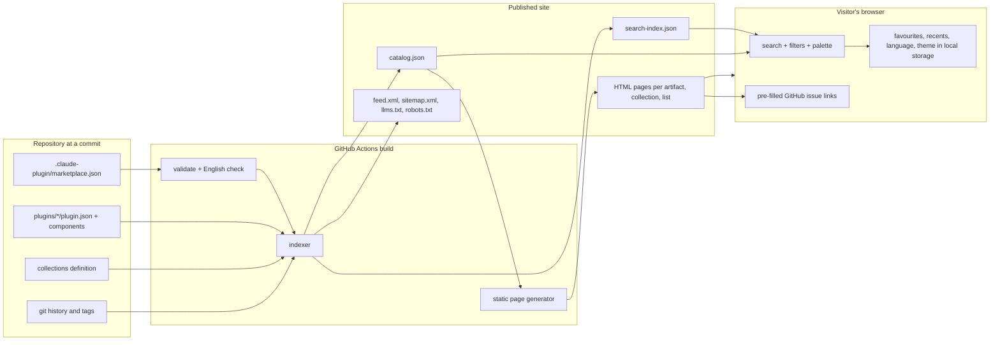
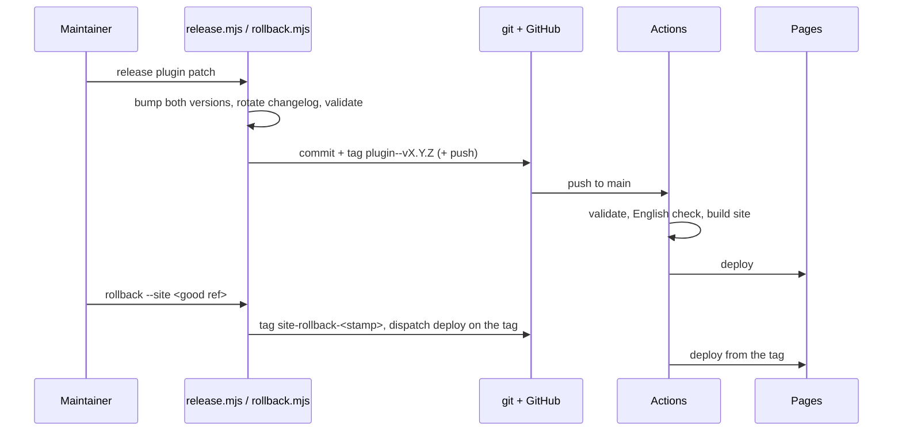

# Spec: Marketplace catalogue site

Spec ID: S01
Status: draft
Supersedes: none

## Problem and user

The marketplace is a JSON catalogue in a git repository.
Today a developer who wants to know whether a plugin, skill or agent exists for their task has to open the repository, read `marketplace.json`, click into each plugin folder, and read frontmatter by hand.
Nothing searches across skill descriptions, agent descriptions and command descriptions at once, and nothing tells them which install command to type or what a plugin will do to their session before they install it.
A team lead who wants to pin a set of plugins for a project has to hand-write the settings snippet and get the `plugin@marketplace` identifiers right by reading the file.

Users:

- **Developer** with Claude Code installed, looking for "something that does X". Wants a search box, a result they can trust, and one command to copy.
- **Team lead** standardising a project on a set of plugins. Wants a settings snippet and a way to see what changed since last month.
- **Contributor** who maintains a plugin in this repository. Wants to see how their plugin is presented and whether it is healthy.
- **Claude Code itself**, or a script, asking "which plugin here matches this task" without a browser.

Constraint that shapes everything: the site is served from GitHub Pages.
There is no server, no database, no secret and no request handler.
Every computation is either done at build time in GitHub Actions or in the visitor's browser.

## Goals and non-goals

Goals:

- One search across every artifact in the repository: plugins, skills, agents, commands, hooks and MCP servers.
- Natural-phrased queries such as "I need a skill for reviewing PRs" return the matching artifacts as cards.
- A page per artifact showing what it is, when it triggers, what it needs, and how to install it.
- Copy-ready install commands and a generator for a project's `.claude/settings.json` snippet.
- Filters, collections, a change feed with RSS, health badges, related artifacts, favourites, a command palette, and machine-readable endpoints.
- English-only content, enforced before anything is published.
- A release and rollback process for the site and for plugins that a maintainer can run in one command.

Non-goals:

- No accounts, no comments, no ratings, no telemetry that leaves the browser. The site collects nothing about visitors.
- No live GitHub API calls from the browser. Stars, commit dates and validation results are captured at build time.
- No semantic (embedding) search in the first release. See Open questions.
- No translation of artifact content. The interface has two languages; the content has one.
- No installation from the site. Claude Code installs plugins; the site hands over the command.
- No indexing of plugins whose source is outside this repository. See Open questions.

## User stories

- As a developer, I type "skill for PR review" and see cards for every skill whose name, description or body matches, with the install command on the card.
- As a developer, I open a card and read the full skill text, which tools it may use, which hook events it registers, and which environment variables its MCP server needs, before I install anything.
- As a developer, I filter to agents only, or to plugins that contain hooks, and share the filtered URL with a colleague.
- As a developer, I press Cmd+K anywhere on the site, type three letters, and jump to an artifact.
- As a developer, I copy the raw `SKILL.md` and drop it into `~/.claude/skills` without adding the marketplace.
- As a developer, I mark artifacts as favourites and find them again on my next visit from the same browser.
- As a team lead, I tick the plugins my project needs and copy a ready `.claude/settings.json` fragment.
- As a team lead, I open a curated collection such as "PR review" and get its settings fragment in one click.
- As a team lead, I subscribe to the RSS feed and learn when a plugin I use has a new version.
- As a contributor, I see a badge on my plugin that says it passed validation at the last build and when it was last changed.
- As a contributor, I see a warning on a plugin nobody has touched for six months.
- As a contributor, I press "Report a problem" on an artifact and land on a pre-filled GitHub issue.
- As a developer, I press "Request a skill" and land on a pre-filled GitHub issue describing what I looked for and did not find.
- As Claude Code or a script, I fetch `catalog.json` and `search-index.json` from stable URLs and search without the page.
- As a Ukrainian-speaking developer, I switch the interface to Ukrainian while artifact content stays English.
- As a maintainer, I release a plugin with one command and roll a broken plugin or a broken site back with one command.

## Module interactions

Three parts, one direction of data flow: repository, then build, then browser.



Boundaries and what crosses them:

- **Repository to indexer.** The catalogue entry list, each plugin manifest, each component's frontmatter and body, `hooks.json`, `.mcp.json`, the collections definition, git commit dates and release tags. The indexer starts from `marketplace.json`; a folder that no entry points at is not an artifact.
- **Indexer to generator and to the browser.** One catalogue document with one record per artifact. Record shape:

```json
{
  "id": "example-plugin/skills/plugin-authoring",
  "type": "skill",
  "name": "plugin-authoring",
  "displayName": "plugin-authoring",
  "plugin": "example-plugin",
  "description": "Use when adding or changing a plugin ...",
  "category": "development",
  "keywords": ["template", "plugin-authoring"],
  "version": "0.1.0",
  "path": "plugins/example-plugin/skills/plugin-authoring/SKILL.md",
  "sourceUrl": "https://github.com/mcmaxwell/devdigest-plugins/blob/<sha>/plugins/example-plugin/skills/plugin-authoring/SKILL.md",
  "install": "/plugin install example-plugin@devdigest-plugins",
  "lastChanged": "2026-09-02",
  "health": { "validated": true, "stale": false },
  "details": { "allowedTools": [], "model": null, "hookEvents": [], "mcpEnv": [] },
  "related": ["example-plugin"]
}
```

  The plugin record additionally lists its components, license, homepage and the changelog entries.
  The search index is derived from the same records, with weighted fields: name and displayName highest, description and keywords next, body lowest.

- **Build to GitHub Pages.** The generated folder. Nothing else.
- **Browser to GitHub.** Only navigation: links to source files and pre-filled issue URLs. No fetches to `api.github.com`.
- **Browser to local storage.** Favourites, recently viewed, interface language, theme. Read inside a guard; the page renders identically when storage is unavailable.

When a neighbour is unavailable:

- The catalogue fails validation or the English check: the build fails and the previous deployment stays live.
- The search index fails to load in the browser: artifact pages, lists and collections still render, because they are static HTML; the search box shows the failure and a link to the full list.
- Local storage is unavailable: favourites and recents are hidden, everything else works.

Release and rollback interactions:



## Acceptance criteria (EARS)

Catalogue and index:

- AC-1: WHEN the build runs, the system shall produce exactly one catalogue record per artifact reachable from an entry in `marketplace.json`, of type plugin, skill, agent, command, hook or mcp-server; observed in `catalog.json`.
- AC-2: IF a folder under `plugins/` has no entry in `marketplace.json`, THEN the system shall exclude it from the catalogue and print its path in the build log.
- AC-3: IF `marketplace.json` or any plugin fails strict validation, THEN the system shall fail the build before generating pages; observed as a failed workflow run with the validation output.
- AC-4: IF any indexed text contains a letter outside the Latin script, THEN the system shall fail the build and name the file and line; observed in the workflow log.
- AC-5: WHEN a record is written, the system shall set `lastChanged` to the date of the last commit that touched the artifact's path; observed in `catalog.json`.
- AC-6: WHEN a record is written, the system shall set `health.stale` to true if `lastChanged` is older than 180 days; observed in `catalog.json` and as the badge on the card.
- AC-7: The system shall serve `catalog.json`, `search-index.json`, `feed.xml`, `sitemap.xml`, `robots.txt` and `llms.txt` at fixed paths under the site root that do not change between builds.
- AC-8: WHEN the catalogue changes shape, the system shall increase a `schemaVersion` field in `catalog.json`; observed in the file.

Search:

- AC-9: WHEN a visitor submits a query, the system shall return every record whose name, displayName, description, keywords or body matches at least one query term after stop words are removed, ranked with name matches above description matches above body matches; observed in the results list.
- AC-10: WHEN a query contains a type word (plugin, skill, agent, command, hook, MCP, or their plural and Ukrainian equivalents listed in the synonym table), the system shall apply that type as a filter and remove the word from the term list; observed as the active filter chip.
- AC-11: WHEN a term differs from an indexed word by at most one character for words of five letters or more, the system shall still match it; observed in results for a misspelled query.
- AC-12: WHEN a term is a prefix of an indexed word, the system shall match it; observed while typing.
- AC-13: WHEN a term appears in the synonym table, the system shall search its English equivalents as well; observed in results for a Ukrainian query term present in the table.
- AC-14: The system shall reflect the query, the active filters and the sort order in the page URL, so that the URL reproduces the same results when opened elsewhere.
- AC-15: IF a query yields no results, THEN the system shall show the empty state with the searched terms, the "Request a skill" action pre-filled with the query, and the three most recently changed artifacts.
- AC-16: WHILE the search index has not finished loading, the system shall show the search box disabled with a loading indicator and keep the full artifact list navigable.
- AC-17: IF the search index fails to load, THEN the system shall show an error in place of the results with a link to the full list, and shall not show an empty results state.
- AC-18: WHEN the visitor presses Cmd+K or Ctrl+K on any page, the system shall open the command palette with the same search behaviour and keyboard navigation over results; observed on any page.

Cards and artifact pages:

- AC-19: The system shall render each result as a card showing type badge, name, parent plugin, description, category, version, up to five keywords, health badge, an install button and a source link.
- AC-20: WHEN the install button is pressed, the system shall copy the exact install command for the parent plugin to the clipboard and confirm it visually for two seconds.
- AC-21: The system shall serve one static page per artifact whose content is readable with scripts disabled; observed by loading the page with JavaScript off.
- AC-22: WHEN an artifact page for a skill, agent or command is opened, the system shall show the rendered body, the frontmatter fields the artifact declares, the file tree of its folder, and the source link at the commit the site was built from.
- AC-23: WHEN an artifact page for a hook is opened, the system shall list the events it registers, the matchers, and the commands it runs.
- AC-24: WHEN an artifact page for an MCP server is opened, the system shall list the command, the arguments and every environment variable name it references, without values.
- AC-25: WHEN an artifact page is opened, the system shall show up to six related artifacts ranked by shared keywords, same plugin and same category, in that order of weight.
- AC-26: WHEN the "Copy raw" action is used on a skill, agent or command, the system shall copy the file's full text unchanged.
- AC-27: WHEN the "Report a problem" action is used, the system shall open a new GitHub issue URL whose title names the artifact and whose body names the artifact path and the site build commit.

Filters, collections, feed:

- AC-28: The system shall offer filters for type, category, parent plugin, keyword, and component presence (has agents, has hooks, has MCP servers), and shall show the result count for each option.
- AC-29: WHEN a filter changes, the system shall update results without a page reload and update the URL.
- AC-30: The system shall render one page per collection defined in the collections file, listing its artifacts and offering the settings snippet for its plugins.
- AC-31: IF a collection references a plugin that is not in the catalogue, THEN the system shall fail the build and name the collection and the plugin.
- AC-32: WHEN the settings generator has at least one plugin selected, the system shall show a valid `.claude/settings.json` fragment containing `extraKnownMarketplaces` for this marketplace and `enabledPlugins` for the selected plugins, and a copy action.
- AC-33: The system shall render a "What's new" page listing, per plugin, each released version with its date and its changelog entries, newest first.
- AC-34: The system shall publish `feed.xml` containing one item per plugin release with the version, the date, the changelog entries and a link to the plugin page.

Favourites and interface:

- AC-35: WHEN the visitor marks an artifact as favourite, the system shall keep it in local storage and list it on the favourites page on later visits in the same browser.
- AC-36: WHEN the visitor opens an artifact page, the system shall record it in a recents list of at most ten entries in local storage.
- AC-37: IF local storage is unavailable, THEN the system shall hide the favourites and recents features and render everything else unchanged.
- AC-38: The system shall offer the interface in English and Ukrainian, remember the choice in local storage, and default to English.
- AC-39: The system shall render artifact content in English only, regardless of the interface language.
- AC-40: The system shall follow the visitor's light or dark preference and offer a manual switch.
- AC-41: The system shall publish a title, description and Open Graph image for every artifact, collection and list page; observed in the page head.

Machine access:

- AC-42: The system shall publish `llms.txt` at the site root describing the site, the endpoints and the record shape.
- AC-43: The system shall serve `catalog.json` and `search-index.json` with a `Content-Type` of JSON and without authentication.

Release and rollback:

- AC-44: WHEN a commit lands on `main`, the system shall run validation, the English check and the build, and deploy the result to GitHub Pages only if all three pass; observed in the workflow run.
- AC-45: WHEN a maintainer runs the plugin release command with a plugin name and a bump kind, the system shall set the same new version in the plugin manifest and in the marketplace entry, move the changelog's Unreleased notes under the new version, validate, commit, and tag `<plugin>--v<version>`; observed in git history.
- AC-46: IF the plugin changelog has no Unreleased notes, THEN the release command shall stop before writing anything and say so, unless the maintainer passes the override flag.
- AC-47: IF the plugin manifest and the marketplace entry disagree on the version before a release, THEN the release command shall stop and report both values.
- AC-48: WHEN a maintainer runs the plugin rollback command, the system shall restore the plugin folder from the chosen release tag, keep the current changelog with a rollback note, and publish it as a version higher than the current one; observed in git history and in the changelog.
- AC-49: WHEN a maintainer runs the site rollback command with a commit reference, the system shall tag that commit and redeploy the site from the tag without changing `main`; observed as a workflow run on the tag and the site serving that build.
- AC-50: IF the site rollback target is not reachable from any remote branch, THEN the command shall stop and say the commit must be pushed first.

## Edge cases

- Empty catalogue: strict validation already refuses it; the build fails.
- One artifact: the list, the filters and related artifacts render with one item and no empty related section.
- Five hundred artifacts: the index stays within the size budget below; cards paginate at fifty.
- Description longer than 300 characters: cards clamp to three lines with the full text on the page.
- More than five keywords: cards show five and a "+N".
- A plugin with no skills, agents or commands, only hooks: it still gets a plugin page and a hook artifact.
- Two artifacts with the same name in different plugins: ids include the plugin, pages do not collide, search shows both with the plugin name visible.
- A query of stop words only: treated as empty, the full list is shown, no empty state.
- A query longer than 200 characters: truncated to 200 before searching, with a notice.
- Non-Latin query text that is not in the synonym table: searched as-is, likely yields the empty state with the request action.
- Offline after first load: static pages already visited render from cache; search works if the index was loaded; the site states it is offline when a navigation fails.
- Two tabs changing favourites concurrently: last write wins, no error.
- A visitor opens an artifact URL that no longer exists after a rollback: the site's 404 page offers search pre-filled with the slug.
- Build runs while another build is in flight: deployments are serialised; the later commit wins.
- Site rollback while a push to `main` is in flight: the later of the two deployments wins; the rollback command prints this.
- Release on a dirty working tree or off `main`: refused unless overridden.
- Rollback with no earlier tag: refused with the list of tags.
- Clipboard API unavailable (insecure context, old browser): the install command is shown selected in a text field instead of a copy confirmation.

## Non-functional requirements

- Search index plus catalogue: at most 1 MB compressed for 500 artifacts.
- First result rendered within 100 ms of a keystroke on a 2020 laptop, once the index is loaded.
- Largest Contentful Paint of an artifact page under 2.5 s on a simulated slow 4G connection.
- Build time under 5 minutes in GitHub Actions, including validation.
- Accessibility: every interactive element reachable by keyboard, visible focus, WCAG 2.1 AA contrast in both themes, Lighthouse accessibility score of at least 95 on the list, card and artifact pages.
- Works in the current and previous major versions of Chrome, Firefox, Safari and Edge.
- No cookies. Local storage only for the four keys listed in Module interactions.
- Site size under 100 MB in total, well inside the 1 GB Pages limit.
- Zero network requests to hosts other than the site's own origin after the page loads, except the GitHub links a visitor clicks.

## Inputs and provenance

| Input | Source | If absent |
| --- | --- | --- |
| Marketplace catalogue | `.claude-plugin/marketplace.json` at the built commit | build fails |
| Plugin manifests | `plugins/<name>/.claude-plugin/plugin.json` | entry values are used; a missing manifest with no entry version fails validation |
| Skill, agent, command frontmatter and bodies | files under each plugin's component folders | artifact omitted with a build log line if the frontmatter has no description |
| Hook definitions | `hooks/hooks.json` or inline in the manifest | no hook artifact |
| MCP definitions | `.mcp.json` or inline in the manifest | no MCP artifact |
| Changelogs | `plugins/<name>/CHANGELOG.md` | plugin page shows "no changelog"; the feed has no items for it |
| Release tags and commit dates | git history of the checkout, full depth | `lastChanged` falls back to the build date and the badge says so |
| Validation result | the validation step of the same build | build fails, so never absent on a published site |
| Collections | one collections file in the repository, maintained by hand | no collection pages, no error |
| Synonym table | one table in the repository, maintained by hand | English-only matching |
| Site base URL | build configuration | build fails |
| Visitor preferences | local storage | defaults: English, system theme, no favourites |

## Untrusted inputs

- **Markdown bodies of skills, agents and commands.** They are rendered on the site. Raw HTML inside them must be escaped, not rendered; scripts, iframes and event attributes never execute. Links open in the same tab unless they leave the site, in which case they carry `rel="noopener"`.
- **URLs in `homepage`, `repository`, `author.url`.** Only `https:` URLs are rendered as links; anything else is shown as text.
- **Hook commands and MCP arguments.** Shown as text in a code block, never executed, never interpolated into HTML unescaped.
- **Environment variable names in `.mcp.json`.** Names are shown; values, if any were committed by mistake, are never shown, and the English check does not cover secrets, so a separate secret scan is a plan concern.
- **Query string and hash of the page URL.** Reflected into the search box and the filter chips only after escaping; never written into HTML as markup.
- **Local storage contents.** Parsed inside a guard; a malformed value is discarded and replaced with defaults.
- **Pre-filled issue links.** Built from the artifact path and the build commit only; the visitor's query is URL-encoded and limited to 200 characters.
- **Collections file and synonym table.** Maintainer-controlled but validated at build time: unknown plugin names and non-Latin synonyms fail the build.

## Design review

There are no mockups yet; this spec precedes the design.
The states below must appear in the design.

- Search: idle with suggestions, loading index, typing with live results, results with active type chip parsed from the query, empty state with the request action, index failed to load - accepted.
- Card: default, hover with the copy action, copied confirmation, stale badge, favourite toggled, clamped description with "+N" keywords - accepted.
- Artifact page: skill, agent, command, hook, MCP server and plugin variants; each shows a different details block - accepted.
- Settings generator: nothing selected, one selected, many selected, copied - accepted.
- Collections: list, one collection with its snippet, a collection whose plugins have a stale badge - accepted.
- What's new: page and feed link; a plugin with no changelog - accepted.
- Favourites and recents: empty, populated, storage unavailable (features hidden, no error) - accepted.
- Command palette: open, typing, results, no results, keyboard navigation - accepted.
- Interface language switch and theme switch positions in the header, both themes for every state - accepted.
- Mobile layout for the search page and the artifact page, cards in one column, filters in a drawer - accepted.
- 404 page with pre-filled search - accepted.
- Offline notice - accepted.
- A "Trust" notice on the plugin page stating that plugins run code in the user's session and linking to the source - accepted.
- Marketing-style hero on the home page - rejected; the home page is the search page.
- Star counts or download counts on cards - rejected; there is no backend to count, and a build-time star count ages badly.

## Open questions

- Semantic search with embeddings computed at build time and a model running in the browser. Assumption for this spec: not in the first release; the synonym table covers the Ukrainian-to-English gap for the domain words the team actually uses. A later spec can add it without changing the catalogue shape.
- Which artifacts count for plugins whose source is outside this repository (a `github` or `git-subdir` source). Assumption: the first release indexes only relative-path plugins; an external source gets a plugin card built from its marketplace entry alone, with no component artifacts, and the card says so.
- Whether the collections file is hand-maintained or derived from a tag on the entries. Assumption: hand-maintained, validated at build time.
- Whether `catalog.json` and `search-index.json` are a supported contract with a versioning promise. Assumption: yes, with `schemaVersion` and a note in `llms.txt`; breaking changes bump the number.
- Whether the site is published under `https://mcmaxwell.github.io/devdigest-plugins/` or a custom domain. Assumption: the GitHub Pages default; a custom domain changes only the base URL.
- Whether a Ukrainian interface is worth the maintenance of a second string table. Assumption: yes, as the team's own language; the design shows both.
