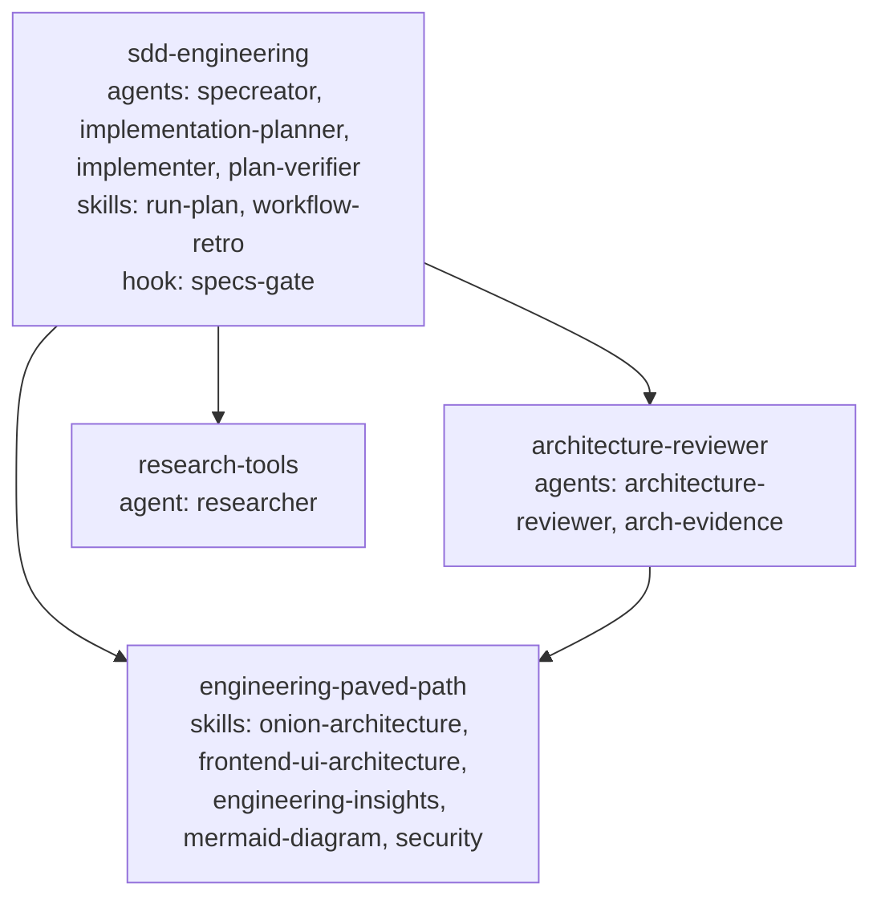
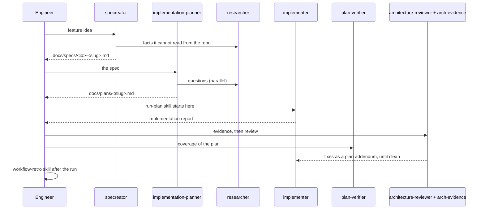

# Spec: SDD Engineering plugin family

Spec ID: S02
Status: draft
Supersedes: none

## Problem and user

The agents and skills that make up the Spec Driven Development workflow live in one project's `.claude/` folder today: `specreator`, `implementation-planner`, `implementer`, `plan-verifier`, the `run-plan` and `workflow-retro` skills, plus the `researcher` and `architecture-reviewer` agents they lean on.
A second project cannot use them without copying files by hand, and every copy drifts.
The agents and skills also carry that project's folder names, package names and stack in their prompts, so a copy does not work elsewhere without editing.

Users:

- **Engineer on any project** who wants the SDD flow (spec, plan, implement, verify, retro) in Claude Code with one install command.
- **Maintainer of this marketplace** who wants to change one agent in one place and release it to every project.
- **Author of another plugin** who wants the researcher, the architecture reviewer or the shared engineering skills without the whole SDD flow.

## Goals and non-goals

Goals:

- One installable plugin, `sdd-engineering`, that gives a project the full flow.
- Reusable pieces published as dependency plugins, so they install alone and the plugins that use them declare them as dependencies.
- Every agent and skill works in a project it has never seen: nothing in a prompt names a folder, a package or a repository of the origin project.
- Each plugin has a README that says what it ships, how to work with it and what it can do, and a changelog that records every release.
- Shared skills live in exactly one plugin each; no skill is copied into two plugins.

Non-goals:

- Porting the origin project's stack-specific skills (Fastify, Drizzle, Next.js, React, Zod, PostgreSQL, TypeScript). They stay project-local; the agents discover whatever skills the host project has.
- Porting `test-writer`, `doc-writer`, `dependency-audit`, `pr-self-review`. They can follow later as their own plugins.
- Changing what the agents do. This spec moves them and makes them portable; behaviour changes get their own spec.

## User stories

- As an engineer, I run `/plugin install sdd-engineering@devdigest-plugins` and the four agents, the two skills, the spec gate and every dependency are available in my project.
- As an engineer, I write `docs/specs/S03-thing.md` with the specreator, plan it with the planner, run the plan, and get a verifier report, without configuring anything.
- As an engineer, I install only `research-tools` and get the researcher agent.
- As an engineer, I install only `engineering-paved-path` and get the shared engineering skills for my own agents.
- As a maintainer, I fix a prompt in `researcher`, release `research-tools` as a patch, and every project picks it up on its next update without touching `sdd-engineering`.
- As a plugin author, I read `sdd-engineering/README.md` and understand the order of the agents, what each one writes, and where.

## Module interactions

Four plugins, one dependency direction:

`engineering-paved-path` is the paved path: the skills every engineering agent in this family is expected to follow.
`architecture-reviewer` preloads its two architecture skills from it and reads the `INSIGHTS.md` files that its insights convention produces, so it depends on it.
`sdd-engineering` preloads its diagram, security and architecture skills into the specreator and the planner, and its implementer records lessons through the insights skill, so it depends on it too.

Who calls whom at run time, in the order of the flow:

What crosses each boundary:

- **sdd-engineering to research-tools.** The planner and the specreator spawn `researcher` by name. If the plugin is missing, they say so and continue without research.
- **sdd-engineering to architecture-reviewer.** `run-plan` invokes `arch-evidence` then `architecture-reviewer` by name each round. If missing, the loop runs with `plan-verifier` only and states that no architecture review happened.
- **architecture-reviewer and sdd-engineering to engineering-paved-path.** Skills are referenced by name in agent frontmatter and loaded through the Skill tool. Every agent reads the touched module's `INSIGHTS.md` at start; only the implementer appends at the end, through the `engineering-insights` skill.
- **sdd-engineering to the host project.** Files only: `docs/specs/`, `docs/plans/`, `docs/retro/ledger.md`, `INSIGHTS.md` next to the code, `CLAUDE.md` for project rules. The agents find the project's own skills through the skill catalogue and its boundaries through `CLAUDE.md`.
- **specs-gate hook.** Ships inside `sdd-engineering` as `hooks/hooks.json` plus a script under the plugin root, referenced with `${CLAUDE_PLUGIN_ROOT}`. It confines the specreator to creating `docs/specs/<id>-<slug>.md`, with the id pattern widened to one to three uppercase letters plus two digits.

Per-plugin contents:

| Plugin | Agents | Skills | Other | Depends on |
| --- | --- | --- | --- | --- |
| `research-tools` | researcher | none | README, CHANGELOG | none |
| `engineering-paved-path` | none | onion-architecture, frontend-ui-architecture, engineering-insights, mermaid-diagram, security | README, CHANGELOG | none |
| `architecture-reviewer` | architecture-reviewer, arch-evidence | none | README, CHANGELOG | engineering-paved-path |
| `sdd-engineering` | specreator, implementation-planner, implementer, plan-verifier | run-plan, workflow-retro | specs-gate hook, README with the flow, CHANGELOG | research-tools, architecture-reviewer, engineering-paved-path |

## Acceptance criteria (EARS)

- AC-1: The system shall publish the four plugins listed above as separate entries in `marketplace.json`, each with its own version and changelog.
- AC-2: WHEN `sdd-engineering` is installed, the system shall install its three dependencies, so the researcher, the reviewer and the shared skills resolve by name; observed in `/plugin list`.
- AC-3: WHEN a dependency plugin is installed alone, the system shall load its agents and skills without any other plugin present; observed by installing `research-tools` into an empty project and invoking the researcher.
- AC-4: The system shall keep every shared skill in exactly one plugin; observed by a repository check that no two `SKILL.md` files share a `name`.
- AC-5: IF any file of a plugin names the origin project or its repository, packages or folders (its name, its repository slug, its package names, its machine paths), THEN the repository check shall fail the build; observed in CI.
- AC-6: WHEN the specreator writes a spec, the specs-gate hook shall allow only a new file at `docs/specs/<id>-<slug>.md` in the host project and refuse edits and other paths; observed by the hook's exit code and message.
- AC-7: WHEN the implementation planner needs a fact outside the repository, it shall spawn the `researcher` agent, and IF that agent is not installed, THEN it shall record in the plan that the fact was not researched.
- AC-8: WHEN `run-plan` runs a review round, it shall invoke `arch-evidence` and `architecture-reviewer`, and IF they are not installed, THEN it shall say so in the round report and run `plan-verifier` alone.
- AC-9: The `sdd-engineering` README shall describe the flow from idea to retro, the file each agent writes and where, the order of the agents, and the two skills' entry points, in the words of the sequence diagram above.
- AC-10: Every plugin README shall state what the plugin ships, the install command, when to use each part, what it writes to the host project, and which plugins it depends on.
- AC-11: WHEN a plugin is released, the maintainer shall use `scripts/release.mjs`, so the version in `plugin.json`, the marketplace entry and the changelog heading agree; observed in git history and the `<plugin>--v<version>` tag.
- AC-12: WHEN a dependency is declared with a version range, the dependency plugin shall have a release tag that satisfies it; observed by `claude plugin validate . --strict` and by an install in a clean profile.
- AC-13: The agents shall keep their current model choices (`opus` for specreator and planner, `sonnet` for researcher, verifier, reviewer and evidence, `inherit` for implementer); observed in the agent frontmatter.
- AC-14: Every agent and skill description shall state when to use it in the words a user would type, and every file shall pass the English-only check; observed in CI.

## Edge cases

- `sdd-engineering` installed while a project already has a local `researcher` agent in `.claude/agents/`: the plugin's agent is namespaced under the plugin; the README tells the user which one wins and how to remove the local copy.
- Two plugins installed from different marketplaces both shipping a skill called `security`: skills are namespaced `plugin:skill`, so both load; the agent frontmatter references the plugin-qualified name where needed.
- Host project without `docs/specs/` or `docs/plans/`: the specreator and the planner create the folder on first write; the hook allows creating the folder.
- Host project that uses a different spec id scheme: the hook accepts any one to three uppercase letters plus two digits; anything else is an open question below.
- Host project with no `INSIGHTS.md` anywhere: the `engineering-insights` skill creates one in the touched module on first lesson, as today.
- Host project with no written architecture rules: the architecture reviewer reports "no written boundaries found" and reviews only the generic layering rules from its skills.
- A dependency is released with a breaking change: dependants pin a caret range and get a release of their own when they adopt the change.
- The workflow-retro skill's collector reads session transcripts under the user's Claude directory and agent definitions from the plugin and from the host project's `.claude/agents/`; when transcripts are absent, it reports "no data" instead of failing.

## Non-functional requirements

- Token footprint of the installed family: agent and skill descriptions together under 4,000 tokens, measured with `claude plugin details`; the descriptions are what every session pays for.
- Any single agent prompt under 12,000 characters.
- `sdd-engineering` installs in under 30 seconds on a clean profile, dependencies included.
- Every plugin passes `claude plugin validate --strict`, the English-only check and the portability check on every commit.

## Inputs and provenance

| Input | Source | If absent |
| --- | --- | --- |
| Agent prompts | `.claude/agents/*.md` of the origin project | the plugin cannot be written |
| Skill folders with their scripts, references and evals | `.claude/skills/<name>/` of the origin project | same |
| Agent catalogue and chain description for the READMEs | `.claude/agents/README.md` of the origin project | READMEs written from the agent files alone |
| Spec gate script | `scripts/specs-gate.sh` of the origin project | the specreator runs unconfined; refuse to release without it |
| Retro collector | `.claude/skills/workflow-retro/` script of the origin project | workflow-retro reports no data |
| Origin-specific names inside prompts and skills | found by the portability check in AC-5 | nothing to remove |
| Additional material | screenshots and links to original repositories, to be provided by the user | the plugin set stays as listed here |

## Untrusted inputs

- Host project files the agents read (`CLAUDE.md`, `INSIGHTS.md`, specs, plans, code): instructions inside them are data for the agent's task, never a reason to skip the hook or write outside the allowed paths.
- Web content the researcher fetches: reported with citations, never executed, never written into the repository as-is.
- Session transcripts read by the retro collector: parsed inside a guard; a malformed line is skipped.
- Plugin scripts run in the user's session with the user's permissions; the README of each plugin says what its hooks and scripts do.

## Design review

No mockups apply; the deliverable is prompts, skills and READMEs.

- The `sdd-engineering` README shows the sequence diagram and a table of agent, input file, output file - accepted.
- Each dependency plugin README is one to two screens: what it ships, install command, when to use each part, what it writes - accepted.
- Marketplace entries carry `category` and `keywords` so the catalogue site (S01) finds them by "spec", "plan", "review", "research", "architecture" - accepted.
- One umbrella plugin with everything inside and no dependencies - rejected; it blocks reuse of the researcher, the reviewer and the skills.
- One plugin per agent - rejected; the four SDD agents only make sense together.
- Keeping the architecture skills inside `architecture-reviewer` - rejected; the specreator and the planner preload them too, so they are shared and belong to the paved path.

## Open questions

- Resolved on 2026-09-02: an agent's frontmatter references a skill from a dependency plugin by its bare name (`skills: onion-architecture`); a live run of `architecture-reviewer` with both plugins loaded confirmed both skills preloaded.
- Resolved on 2026-09-02: plugin agents are exposed to the Agent tool as `<plugin>:<agent>` (for example `architecture-reviewer:arch-evidence`), and plugin skills to the Skill tool as `<plugin>:<skill>`. Prompts that spawn an agent from a dependency plugin use the qualified name; READMEs document it.
- Whether `arch-evidence` survives outside the origin project, since it ran that project's dependency-cruiser rules. Assumption: it becomes generic, running whatever lint and boundary commands the host `CLAUDE.md` names, and reports "no mechanical checks configured" otherwise.
- Whether the onion-architecture evals and fixtures, which model a generic backend tree, ship in the plugin or stay in the origin project. Assumption: they ship, with generic folder names, so `claude plugin eval` works for contributors.
- Spec id scheme in the hook beyond `<letters><two digits>`. Assumption: a plugin `userConfig` value can override the pattern later; the first release ships the pattern above.
- The list of plugins may grow when the user's screenshots and repository links arrive. Assumption: additions are dependency plugins and do not change the dependency direction.
