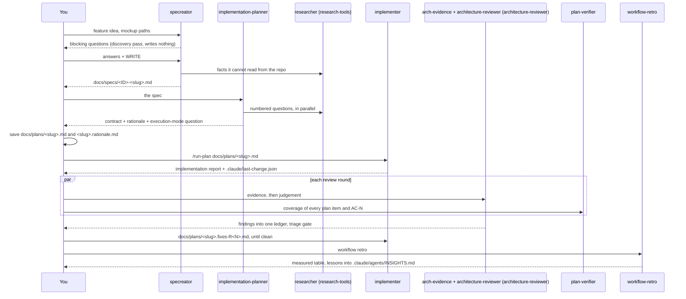

# sdd-engineering

Spec Driven Development Engineering for Claude Code: a feature goes from an idea to a spec, from the spec to a plan, from the plan to a reviewed implementation, and from the implementation to a coverage verdict and a retro, with each step leaving a file in your repository that the next step reads.
The product decision (the spec) and the architecture decision (the plan) are made in a conversation with you; everything after them is mechanical enough to automate, so a skill drives it.
Nothing in this plugin commits, pushes or opens a pull request; every run ends with a dirty working tree and a report for you to review.

## Install

```
/plugin marketplace add mcmaxwell/devdigest-plugins
/plugin install sdd-engineering@devdigest-plugins
```

The three plugins it depends on - `research-tools`, `architecture-reviewer:architecture-reviewer` and `engineering-paved-path` - install with it.
If you do not see a release, run `/plugin marketplace update devdigest-plugins` first.

## What it ships

| Part | Kind | Model | Entry | Writes to your project |
| --- | --- | --- | --- | --- |
| `specreator` | agent | `opus` | "write a spec for ...", "spec this feature" | `docs/specs/<ID>-<slug>.md`, create-only |
| `implementation-planner` | agent | `opus` | "plan this", "plan the spec" | nothing itself; you save its report as `docs/plans/<slug>.md` and `docs/plans/<slug>.rationale.md` |
| `implementer` | agent | `inherit` | "implement the plan" (normally through `run-plan`) | the code the plan names, `INSIGHTS.md` next to it, `.claude/last-change.json` |
| `plan-verifier` | agent | `sonnet` | "verify the plan", "what of the plan landed" | nothing; read-only |
| `run-plan` | skill | - | `/run-plan docs/plans/<slug>.md` | `docs/plans/<slug>.fixes-R<N>.md` per fix round, `.git/run-plan.json` for the ledger |
| `workflow-retro` | skill | - | "workflow retro", "how did that run go", "how much did that cost" | `.claude/agents/INSIGHTS.md`, one line in `docs/retro/ledger.md` |
| `specs-gate` | hook | - | runs on every `Write` and `Edit` | nothing; blocks the specreator outside `docs/specs/` |

Agents are also addressable by their plugin-qualified name, `sdd-engineering:specreator` and so on; the bare name works when no other agent of that name is installed.
If your project already has a local `.claude/agents/specreator.md`, the local one wins for the bare name, and you should delete it to use the plugin's.

## How it works together



| Agent | Reads | Writes | Where |
| --- | --- | --- | --- |
| `specreator` | your idea, mockup screenshots, `CLAUDE.md`, neighbouring specs, the code at each boundary | the spec | `docs/specs/<ID>-<slug>.md` |
| `implementation-planner` | the spec, `CLAUDE.md`, the touched modules' `AGENTS.md` and `INSIGHTS.md`, the skill catalogue, the code | contract and rationale, as a report you save | `docs/plans/<slug>.md`, `docs/plans/<slug>.rationale.md` |
| `implementer` | the plan path, `CLAUDE.md`, the touched modules' `AGENTS.md` and `INSIGHTS.md`, the code and its callers | the change, lessons, the manifest | the code, `<module>/INSIGHTS.md`, `.claude/last-change.json` |
| `architecture-reviewer:arch-evidence` | the manifest, the host's lint and boundary commands | an observation table, returned | - |
| `architecture-reviewer:architecture-reviewer` | the observation table, the written boundary rules | findings, returned | - |
| `plan-verifier` | the plan, the manifest, the code | a per-item coverage table, returned | - |
| `run-plan` (skill) | the plan, the spec, every report above | fix addenda and the ledger | `docs/plans/<slug>.fixes-R<N>.md`, `.git/run-plan.json` |
| `workflow-retro` (skill) | the session transcripts, the agent definitions | lessons and one run-log line | `.claude/agents/INSIGHTS.md`, `docs/retro/ledger.md` |

`specreator` and `implementation-planner` are run by hand, on purpose.
They are where the product decision and the architecture decision get made, and a decision made inside an automated chain is a decision nobody reviewed.

There is no direct channel between agents, with one exception: the specreator and the planner may spawn `research-tools:researcher` themselves, because a fact gap discovered mid-plan would otherwise cost a full round trip through you.
Every other handoff relays through your session, so it stays visible before the next agent starts.

Three things travel as paths rather than as pasted text, because a fresh context is expensive and re-deriving a fact costs more than reading it:

- **The plan, split in two.** The contract is what gets built; the rationale is why. The implementer never opens the rationale, which keeps roughly half the plan out of the context that writes code.
- **`.claude/last-change.json`.** The implementer's manifest of what it touched, with the plan step behind each file and an explicit list of paths that belong to somebody else's uncommitted work. Reviewers start from it instead of re-deriving scope from `git status`.
- **The fix addendum.** Each review round's findings become `docs/plans/<slug>.fixes-R<N>.md`, a plan-shaped file, because the implementer executes plans and nothing else.

## Working with it

**1. Spec.**
Type `Use specreator to spec <feature>; mockups at docs/design/a.png, docs/design/b.png`.
The first pass is discovery: it comes back with an Understanding paragraph, the designs it read, the boundaries it found, at most seven blocking questions each with a recommended answer, the design states the mockups never showed, and the line "Nothing was written".
Answer the questions, then type `Use specreator to WRITE the spec with these answers: ...`.
It returns the spec path, the `AC-N` table, the decisions it took from your answers, its assumptions, and a "Needs a human edit" list (approve the spec, mark an older one superseded).

**2. Plan.**
Type `Use implementation-planner to plan docs/specs/S03-thing.md`.
It may come back with up to three clarifying questions, each with the default it would use; answer or accept the defaults.
It returns two halves and a closing question.
Save the first half as `docs/plans/<slug>.md` and the second as `docs/plans/<slug>.rationale.md`, then answer the execution-mode question: multi-agent (`run-plan`) or single-agent (one session does it all).

**3. Run.**
Type `/run-plan docs/plans/<slug>.md`, optionally with `--designs <paths>`, `--deep` (adds `/code-review` to each round), `--rounds <N>` (default 3), `--docs` (runs your project's `doc-writer` if it has one).
Preflight refuses the default branch and records the files that were already dirty, so they never enter a fix round.
After the build, each review round runs `architecture-reviewer:arch-evidence` and `plan-verifier` in parallel, then `architecture-reviewer:architecture-reviewer` on the evidence, and merges everything into one ledger.
The run stops once per round at the triage gate: a table of findings with BLOCKING rows defaulted to `fix` and ADVISORY rows to `accept`, so a bare "go" is a complete answer; `accept` and `defer` need a reason, which is quoted in the final report.
It ends with a report - plan coverage, each `AC-N` and where it is satisfied, rounds, unresolved findings, the test commands with their real output, untested behaviour, files - and a dirty tree.

**4. Verify on its own.**
Type `Use plan-verifier on docs/plans/<slug>.md against the working tree` when you executed a plan without `run-plan` or want a second reading.
It declares the item count, then returns one row per plan item marked `done`, `partial`, `missing`, `deviated` or `unverifiable`, each with `path:line` evidence or the searches it ran.

**5. Retro.**
Type `workflow retro`.
It measures the session from the transcripts (never from memory), answers the sequencing, duplication, friction, coverage and fit questions from evidence, appends the lessons that pass its gates to `.claude/agents/INSIGHTS.md`, adds one dated line to `docs/retro/ledger.md`, and proposes edits to agent definitions with the evidence, without applying them.

## Conventions in your project

The plugin's contract with a host project is a handful of files and folders; it creates them on first use.

| Path | Holds | Written by |
| --- | --- | --- |
| `docs/specs/<ID>-<slug>.md` | one product spec per feature | `specreator`, create-only |
| `docs/specs/README.md` | optional: your own template and naming rule, which override the defaults below | you |
| `docs/plans/<slug>.md`, `<slug>.rationale.md` | the plan's contract and its rationale | you, from the planner's report |
| `docs/plans/<slug>.fixes-R<N>.md` | fix addenda per review round | `run-plan` |
| `docs/retro/ledger.md` | one dated line per retro: agents, tokens, wall clock, outcome | `workflow-retro` |
| `.claude/agents/INSIGHTS.md` | lessons about the agents and how runs are orchestrated | `workflow-retro` |
| `<module>/INSIGHTS.md` | lessons about the code, next to the code | `implementer`, through `engineering-insights` |
| `.claude/last-change.json` | the implementer's change manifest for the reviewers; add it to `.gitignore` | `implementer` |
| `.git/run-plan.json` | the run's state and finding ledger; inside `.git/` so it is never committed | `run-plan` |
| `CLAUDE.md`, `AGENTS.md`, `TESTING.md` | how the agents learn your layout, test commands, boundary rules and do-not-touch paths | you |

**Spec ids** are a short uppercase prefix and two digits: `S01`, `L07`, `ADR12`.
The specreator scans `docs/specs/` for the prefix in use and takes the next free number; a project with no specs starts at `S01`.
An id is never reused; a decision that replaces an earlier one gets a new file with `Supersedes: <old id>`, and the old file is marked superseded by hand.

**Spec template.**
A spec starts with `# Spec: <name>`, `Spec ID`, `Status` (`draft` when written; you move it to `approved` or `implemented`) and `Supersedes`, then eleven sections in this order, none empty: Problem and user; Goals and non-goals; User stories; Module interactions; Acceptance criteria (EARS); Edge cases; Non-functional requirements; Inputs and provenance; Untrusted inputs; Design review; Open questions.
Acceptance criteria use EARS: stable `AC-N` ids, one requirement each, an observation point each, and one of five forms - `The system shall`, `WHEN <trigger>, the system shall`, `WHILE <state>, the system shall`, `IF <condition>, THEN the system shall`, `WHERE <feature>, the system shall`.
Vague predicates (`fast`, `robust`, `properly`, `gracefully`) are banned, and so is implementation detail (table names, function signatures, new file paths), which belongs to the plan.
The planner cites `AC-N` ids verbatim in its traceability table, and the verifier checks every one of them.

**The hook.**
`hooks/hooks.json` registers `scripts/specs-gate.sh` as a `PreToolUse` hook on `Write` and `Edit`.
It is silent for every caller except the specreator (bare `specreator` or `<plugin>:specreator`), for which it blocks, with exit code 2 and a message the agent sees:

- any `Edit` - a spec is created once and never edited in place;
- any `Write` outside `docs/specs/<ID>-<slug>.md`, where the id is one to three uppercase letters plus two digits and the slug is lowercase;
- any `Write` to a path that already exists.

It is plain bash with no dependencies, reads the hook payload from stdin, and never writes anything.

## Dependencies

| Plugin | Provides | Used by |
| --- | --- | --- |
| `research-tools` | the `research-tools:researcher` agent: read-only research inside the repository and on the web, with citations | `specreator` and `implementation-planner`, for facts they cannot read from the repository |
| `architecture-reviewer:architecture-reviewer` | `architecture-reviewer:arch-evidence` (mechanical boundary checks, no judgement) and `architecture-reviewer:architecture-reviewer` (judges the evidence against the project's written rules) | every `run-plan` review round |
| `engineering-paved-path` | the shared skills `onion-architecture`, `frontend-ui-architecture`, `mermaid-diagram`, `security` and `engineering-insights` | preloaded into `specreator` and `implementation-planner`; `engineering-insights` runs at the implementer's wrap-up and is the counterpart of `workflow-retro` |

Each dependency also works alone; install `research-tools` on its own if you only want the researcher.

## Versions and releases

Changes are recorded in [CHANGELOG.md](CHANGELOG.md) under `## Unreleased` and rotated into a version heading at release time.
Releases are tagged `sdd-engineering--v<version>`, and the version in `.claude-plugin/plugin.json` always matches the marketplace entry.
Claude Code caches a plugin by version, so a change only reaches you through a new version: update the marketplace (the command in Install above), then update the plugin.

## Troubleshooting

**"researcher agent not installed" in a spec or plan.**
The `research-tools` dependency did not install or was removed.
The specreator marks the fact `not researched` in Open questions and the planner records it under Risks with the assumption it used; both continue.
Install `research-tools` from the same marketplace and re-run the pass if the fact matters.

**The hook blocked a write.**
The message names the rule: wrong tool (`Edit`), wrong path, or an existing file.
For the specreator that is correct behaviour - answer with a new id or a `Supersedes:` file rather than working around it.
If the block hit another agent or you, the payload's `agent_type` ended in `specreator`; check which agent you launched.

**`plan-verifier` reports missing items.**
`missing` comes with the searches it ran.
Inside `run-plan` a missing plan item or `AC-N` is BLOCKING and becomes a fix-round step; outside it, hand the missing rows to the implementer as a plan-shaped addendum, or send the plan back to `implementation-planner` if the item was never buildable.
`unverifiable` is not a failure: it lists what needs a running app or a human eye, with the manual check that would settle it.

**No architecture review happened.**
`run-plan` says so when `architecture-reviewer:arch-evidence` and `architecture-reviewer:architecture-reviewer` are not available; the round ran with `plan-verifier` only.
Install `architecture-reviewer:architecture-reviewer` from the same marketplace and start a new run.

**`workflow retro` prints "no data".**
The collector found no transcript for the current directory under the Claude projects folder.
Run it from the directory the session ran in, or pass `--session <uuid>`.

## License

MIT - see the repository [LICENSE](../../LICENSE).
